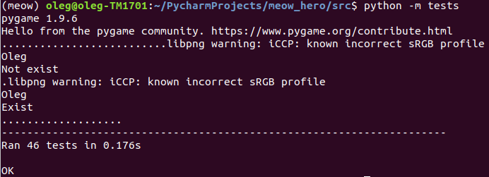
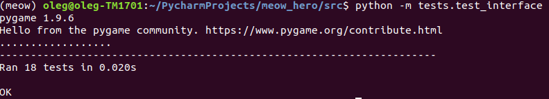

# Refactoring report (for lab 4)

Flaw description | commit| Refactoring description | Conclusion | Tests result
--- | --- | --- | --- | ---
[switch #17][i17] | [link][c27] |Сгруппировал данные конфигурации противников для уровней в 1 месте, отдельно от игровой логики. Метод выбран, потому что позволяет видеть\менять конфигурацию в одном отдельном от игровой логики месте| Читаемость улучшилась за счет того, что теперь конфигурация противников лежит в одном отдельном от игровой логики месте | 
[conditional complexity #7][i7] | [link][c7] | Применил консолидацию дублирующихся условных фрагментов. Метод выбран потому, что во всех ветвях условного выражения выполнялась проверка одного и того же условия | Читаемость улучшилась за счет того, что исчез дублирующийся код, стала понятнее логика обработки ивентов интерфейса | тестов не было
[data clump #18][i18]| [link][c18] | Применил введение граничного объекта. Метод выбрал потому, что группа параметров всегда встречается вместе | Читаемость улучшилась за счет того, что сократился размер списка параметров |  
Duplicate code | [link][cm1] | Применил консолидацию дублирующихся условных фрагментов. Метод выбран потому, что во всех ветвях условного выражения вычислялись одни и те же значения | Читаемость улучшилась за счет того, что исчез дублирующийся код | -

[i1]: https://github.com/merry-cooperation/refactorMeowHero/issues/1
[i7]: https://github.com/merry-cooperation/refactorMeowHero/issues/7
[i17]: https://github.com/merry-cooperation/refactorMeowHero/issues/17
[i18]: https://github.com/merry-cooperation/refactorMeowHero/issues/18
[i23]: https://github.com/merry-cooperation/refactorMeowHero/issues/23
[i27]: https://github.com/merry-cooperation/refactorMeowHero/issues/27
[i28]: https://github.com/merry-cooperation/refactorMeowHero/issues/28
[i39]: https://github.com/merry-cooperation/refactorMeowHero/issues/39
[i45]: https://github.com/merry-cooperation/refactorMeowHero/issues/45

[c7]: https://github.com/merry-cooperation/refactorMeowHero/commit/451399c4a1daa63dc72064e5775724152697fe88
[c18]: https://github.com/merry-cooperation/refactorMeowHero/commit/26848c627ec6724e75f0b7af7583e1e52dc5ed4c
[c27]: https://github.com/merry-cooperation/refactorMeowHero/commit/61421d9f0f3a2aadefb6217da4809dee5cfee87e

[cm1]: https://github.com/merry-cooperation/refactorMeowHero/commit/74e5dbfc48e1fa73d8adfee2cee7480532300f06